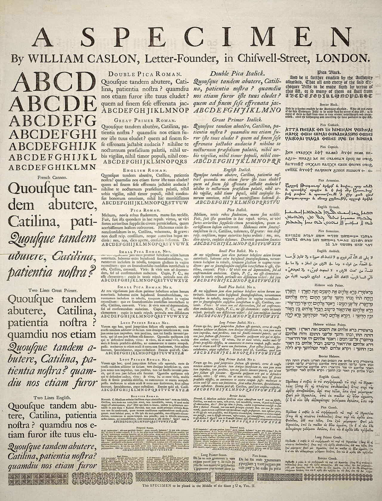

# Chapter 3

The chapter text is made with placeholder or as it's referred to in publishing Lorem Ipsum (The Author 2026) the industry-standard term for \"dummy\" or \"filler\" text used to preview a layout before the final content is ready. Generated from the website: <https://lipsum.com/>

## Top level section (h2)

Lorem ipsum dolor sit amet, consectetur adipiscing elit. Nunc vehicula purus metus, imperdiet ornare elit dapibus mattis. Morbi luctus efficitur condimentum. Nam mollis dolor quam, eu auctor quam mattis ut. Sed dolor arcu, vestibulum non ex ut, eleifend venenatis risus. Phasellus magna turpis, dignissim sed tincidunt vel, semper quis quam. Nulla vehicula erat tellus, eget varius enim placerat vel. Sed in ornare lorem. Nunc imperdiet, ante in fermentum sagittis, turpis dui aliquet nisi, eget lobortis quam turpis sit amet nulla. Phasellus at leo sit amet dui accumsan malesuada a eu ligula. Donec tincidunt lectus nec metus sagittis, at feugiat risus congue.

{width="6.925in" height="9.094444444444445in"}1: By William Caslon - \[1\], uploaded to the English Wikipedia by Janke as Image:Caslonsample.jpg , 16:26, 23 March 2006, Public Domain, <https://commons.wikimedia.org/w/index.php?curid=391754>

Nunc dictum sapien mi, quis pellentesque lorem porttitor eget. Curabitur vel pretium tortor. Aliquam ac ante tincidunt sapien pharetra facilisis. Sed sit amet mi tincidunt ipsum pellentesque aliquet id vel velit. Aenean eleifend sem sit amet mauris sagittis, vitae posuere ipsum placerat. Cras semper egestas urna. In maximus nulla ac magna rutrum, posuere consequat felis facilisis. Nullam lacinia nec dui at mollis. Quisque cursus risus sem, dignissim consectetur enim lacinia ac. Integer libero mi, varius eget tortor ac, maximus facilisis neque. Nullam commodo euismod ipsum ac imperdiet. Duis at imperdiet elit. Pellentesque eget enim sed eros consequat ultrices sed vitae lorem. Proin vitae nisi felis. Vestibulum ullamcorper, enim vel interdum congue, purus odio placerat lacus, id aliquam erat mi id arcu.

Nam vel accumsan risus, nec cursus mi. Vestibulum sed tincidunt sem. Proin dignissim libero quis purus placerat ornare. Nam ac laoreet dolor, sit amet varius arcu. Quisque molestie pretium enim eu congue. Integer ac semper lectus, eget fringilla ex. Duis id mauris sed ipsum finibus congue.

### Section (h3)

Lorem ipsum dolor sit amet, consectetur adipiscing elit. Donec volutpat suscipit tortor vitae ornare. Sed sed lorem dolor. Donec nec turpis accumsan, facilisis enim eu, porta purus. Praesent nec nisi orci. Quisque hendrerit neque nec felis eleifend, id dictum lacus rhoncus. Praesent id volutpat ex, sed tempor odio. Aliquam eros libero, auctor eget nisi aliquam, commodo venenatis velit. Quisque sodales ex quis interdum condimentum. Mauris aliquet arcu ut purus eleifend hendrerit. In convallis ut nisl eget malesuada.

Nulla ipsum leo, egestas eget fringilla quis, elementum ut justo. In sapien metus, elementum vitae pulvinar id, viverra vel mauris. Phasellus vitae ultricies ex. Aenean blandit, sapien sed laoreet lacinia, est nunc volutpat mi, eget elementum turpis odio ac leo. Cras non sapien et enim malesuada lobortis auctor vel augue. Nullam leo nibh, finibus et nisi ac, porttitor mollis diam. Vestibulum blandit, nulla nec placerat aliquet, leo velit vehicula nisl, a rutrum leo dui aliquam sem. Curabitur sed tortor mauris. Suspendisse vestibulum augue eget dui vestibulum, gravida gravida turpis lacinia. Aenean a magna aliquet, elementum quam sed, bibendum felis. Etiam ac erat ornare, pharetra leo sagittis, aliquet nisi. Integer nec enim quis quam feugiat consectetur et nec diam. Donec enim felis, facilisis nec gravida sit amet, efficitur quis lectus. Ut eleifend leo lorem, eu congue mi accumsan in.

#### Section (h4)

Lorem ipsum dolor sit amet, consectetur adipiscing elit. Quisque suscipit venenatis sapien, et luctus neque maximus in. Etiam lobortis pharetra dolor, vitae egestas elit facilisis eget. Aenean est odio, viverra eget porttitor at, posuere ut diam. Phasellus laoreet dolor quis nibh consequat mattis. Nulla semper pharetra eros non vehicula. Etiam et volutpat nisl. Morbi vestibulum imperdiet ullamcorper.

##### Section (h5)

Lorem ipsum dolor sit amet, consectetur adipiscing elit. Etiam sapien nisi, egestas sed elit ut, blandit mattis enim. Pellentesque habitant morbi tristique senectus et netus et malesuada fames ac turpis egestas. Class aptent taciti sociosqu ad litora torquent per conubia nostra, per inceptos himenaeos. Lorem ipsum dolor sit amet, consectetur adipiscing elit. Mauris tristique tellus eget posuere dignissim. Donec eu finibus sem, vitae iaculis nibh. In accumsan magna vitae nulla aliquet porta. In imperdiet purus neque, quis pharetra dui commodo id. Maecenas ligula lorem, ornare sed nunc vitae, pellentesque egestas ligula. Suspendisse tempor rhoncus dui ut rutrum. In fermentum, nisi sit amet consectetur scelerisque, mi justo malesuada neque, sit amet vestibulum mauris eros ac felis. Phasellus erat quam, malesuada at purus id, varius ultrices justo. Fusce ante mauris, sodales et feugiat quis, blandit vitae dolor. Vestibulum ante ipsum primis in faucibus orci luctus et ultrices posuere cubilia curae; Phasellus nec tellus consequat, elementum nibh id, ullamcorper enim. Quisque in tortor nec ipsum elementum tristique.

###### Section (h6)

Lorem ipsum dolor sit amet, consectetur adipiscing elit. Curabitur faucibus risus et eros scelerisque ultricies in sit amet purus. Integer tincidunt libero mauris, et dictum lorem pellentesque vel. Aenean interdum vel nisi vitae laoreet. Sed justo massa, luctus ut interdum vitae, porttitor id odio. Nulla faucibus commodo sapien quis aliquet. Vivamus ullamcorper est ut felis vehicula sollicitudin. Curabitur vel erat interdum neque volutpat laoreet et ut nulla.

## Bibliography

The Author. 2026. "Lorem Ipsum." In *Wikipedia*. June 10. <https://en.wikipedia.org/w/index.php?title=Lorem_ipsum&oldid=1358765294>.
